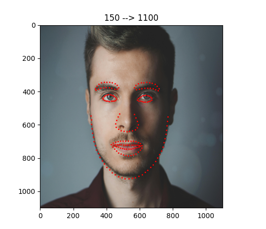
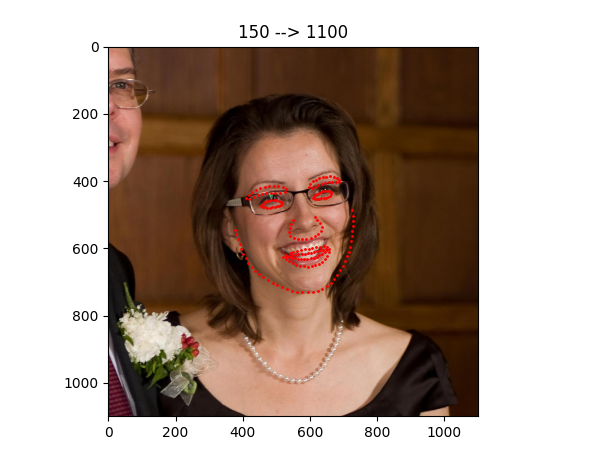
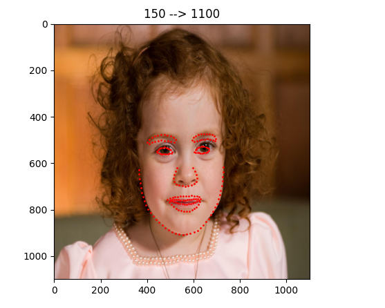
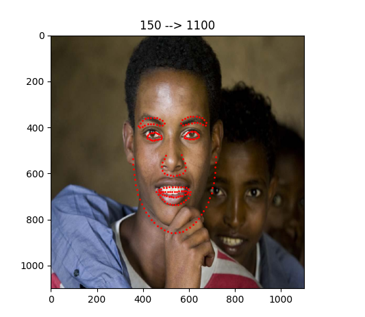
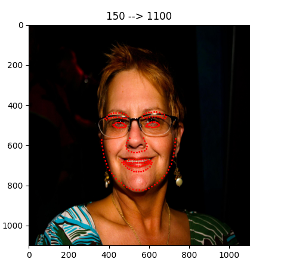
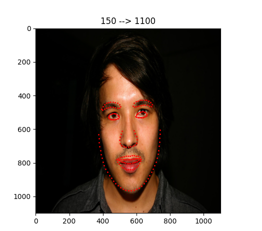
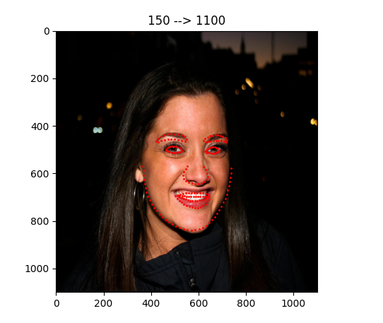
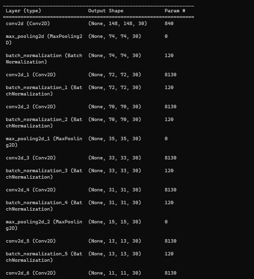

# Facial Landmark Detection using Deep CNN Model

This project implements a deep learning model that detects 138 facial landmark points from images. The model integrates Convolutional Neural Networks (CNN) for feature extraction, Artificial Neural Networks (ANN) for feedforward processing, and Recurrent Neural Networks (RNN) for pattern recognition. It is trained on the Helen Dataset, known for its high-resolution facial images and detailed annotations.

### Overview
Facial landmark detection is crucial in various applications like facial recognition, emotion detection, and augmented reality. This project aims to accurately detect 138 facial landmarks by leveraging a hybrid neural network architecture that combines CNNs, ANNs, and RNNs.

### Features
Multi-layer CNN for robust feature extraction from images.
ANN for efficient feedforward computation.
RNN to capture spatial patterns and dependencies among facial landmarks.
Training on Helen Dataset ensures high-quality annotations and diverse facial representations.
Outputs 138 facial landmarks, providing detailed facial feature mapping.

### Prerequisites
Python 3.7 or higher
Libraries:
TensorFlow 2.x
NumPy
OpenCV
Matplotlib

### Acknowledgments
Helen Dataset Authors: For providing a comprehensive dataset.

### Pictures of Trained Model:
 

 

 

### Model Architecture:
